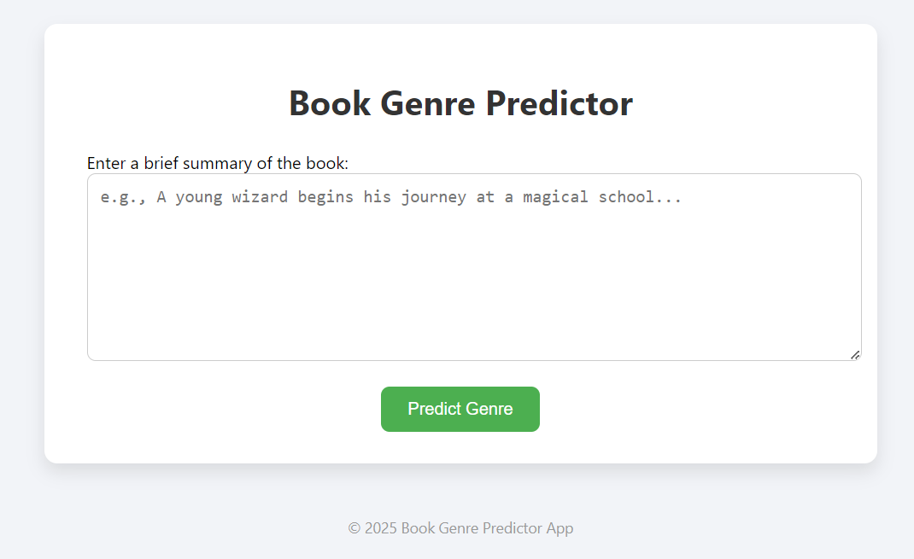
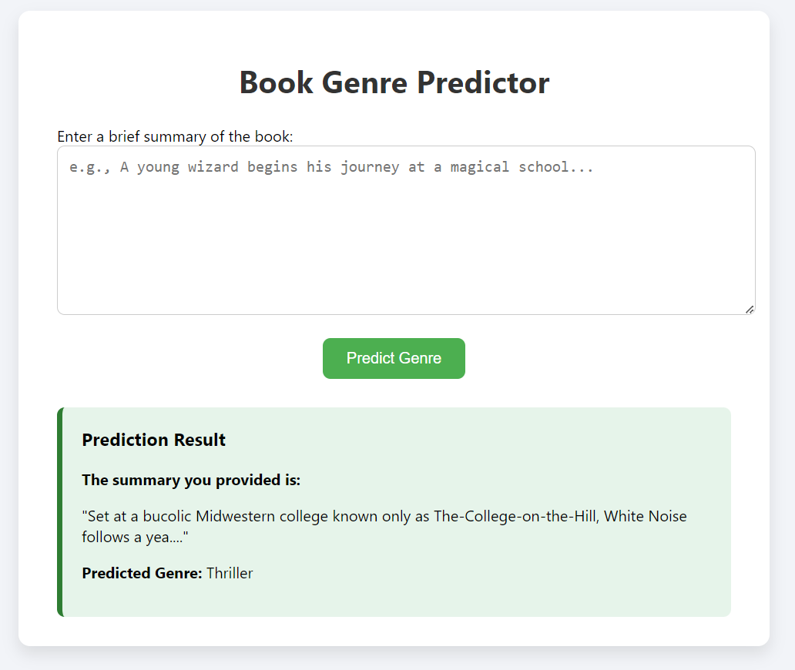

# 📚 Book Genre Prediction Flask App using ML with AWS Deployment

A machine learning-based web application that predicts the **genre of a book** from its summary.  
Built using **Python**, **Scikit-learn**, and a clean web interface with **Flask** and **HTML/CSS**, this app is deployed on **AWS EC2** for public access.

---

## 🖼️ Demo Screenshots

### 🔹 Home Page (User Input Form)

### 🔹 Prediction Result Page


> ⚠️ **Note:** Add your actual screenshots to the `/screenshots` folder and update the paths above.

---

## 🚀 Features

- 📖 Predicts book genres based on summaries using a trained ML model.
- 🧠 Built with Naive Bayes and TF-IDF vectorization.
- 🖥️ Simple and responsive user interface using **HTML/CSS**.
- 🌐 Web server built with **Flask**.
- ☁️ Deployed on **AWS EC2** for live use.

---

## ⚙️ Tech Stack

- **Frontend:** HTML5, CSS3
- **Backend:** Flask (Python)
- **ML Libraries:** scikit-learn, NLTK, pandas
- **Deployment:** AWS EC2 (Ubuntu, Gunicorn, Nginx)

---

## 🧠 How It Works

1. **Input:** User enters a book summary via the web interface.
2. **Preprocessing:**
   - Lowercasing, punctuation removal
   - Stopword removal
   - Lemmatization & stemming using NLTK
3. **Model:**
   - Trained on a labeled dataset using `MultinomialNB`
   - Text features extracted using `TfidfVectorizer`
4. **Output:**
   - Predicts one of the following genres:
     - Fantasy
     - Science Fiction
     - Crime Fiction
     - Historical Novel
     - Horror
     - Thriller

---

## 🧪 Run Locally

1. **Clone the repo**
   ```bash
   git clone [https://github.com/SakethRamkalavakuntla/Book-Genre-predictor-app.git]
   cd book-genre-predictor
